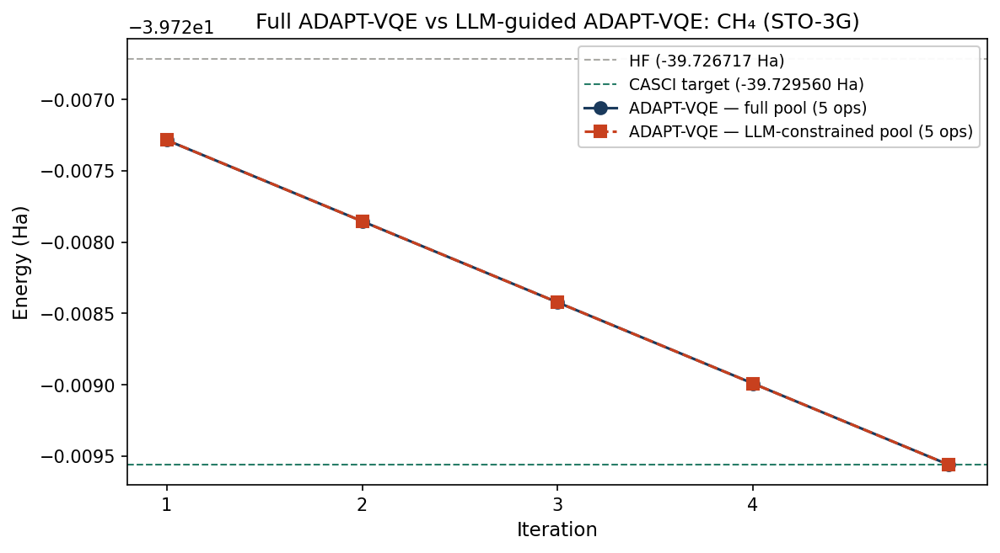

<div style="height: 2.5rem;"></div>

This work builds directly on *Chemically Aware VQE: HF vs UCCSD-VQE vs ADAPT-VQE using CUDA-Q. It is also inspired by the collaboration between Hiverge and Quantinuum on AI-guided quantum algorithm discovery, presented at NVIDIA GTC 2026.

##Chemical reasoning meets quantum algorithms

In the first notebook, we showed that ADAPT-VQE recovers essentially the same ground-state energy as UCCSD for methane — using only 4 operators instead of 8, and therefore a significantly shallower quantum circuit. The selection criterion was purely mathematical: at each iteration, ADAPT-VQE computes the energy gradient with respect to every operator in the pool and adds the one with the largest magnitude.

This raises a question at the intersection of quantum chemistry and agentic AI: could chemical reasoning — encoded in a large language model — make the same selection? For systems larger and more strongly correlated than methane, the operator pool grows rapidly and computing gradients for every operator at every iteration becomes the dominant computational cost. An LLM that reliably pre-selects the most important operators could reduce that cost significantly, without any additional simulation. This notebook tests whether that is possible, at least for a well-understood minimal system.

The experiment proceeds in four steps:

- **Rebuilding the molecular system** — identical setup to notebook one, ensuring a controlled comparison
- **Run ADAPT-VQE** — record which operators were selected and their optimised parameters
- **Ask an LLM** — given the operator pool and molecular context, ask Claude to rank operators by expected chemical importance, *before* seeing the ADAPT-VQE result
- **LLM-guided ADAPT-VQE** — run ADAPT-VQE again within the LLM-constrained pool and compare the energies

::: {.callout-note}
To run this notebook, install dependencies with:
:::

```bash
pip install cudaq cudaq-solvers anthropic
```

```{python}
#| label: imports
#| echo: true
#| eval: false

import cudaq
import cudaq_solvers as solvers
import numpy as np
import pandas as pd
import matplotlib.pyplot as plt
import anthropic
import json
import os
```

## LLM-guided ADAPT-VQE using CUDA-Q

This notebook uses the same molecular system as notebook one — methane (CH₄) in a minimal STO-3G basis, with a 2-electron, 3-orbital active space giving 6 qubits — and extends it by introducing an LLM in the operator selection loop. All Hamiltonians and reference states are identical to notebook one to ensure a fair and controlled comparison.

### Rebuilding the molecular system

We begin by reconstructing the molecular Hamiltonian from the first notebook. The reference energies — HF at −39.726717 Ha and CASCI at −39.730452 Ha — define the same benchmarks as before.

```{python}
#| label: rebuild-molecule
#| echo: true
#| eval: false

name = "CH4"

atoms = [
    ["C",  0.0000,  0.0000,  0.0000],
    ["H",  0.6291,  0.6291,  0.6291],
    ["H", -0.6291, -0.6291,  0.6291],
    ["H", -0.6291,  0.6291, -0.6291],
    ["H",  0.6291, -0.6291, -0.6291],
]

geometry = [(e, (x, y, z)) for e, x, y, z in atoms]

molecule = solvers.create_molecule(
    geometry,
    "sto-3g",
    0,   # total spin 2S
    0,   # charge
    nele_cas=2,
    norb_cas=3,
    casci=True,
    verbose=False
)

H           = molecule.hamiltonian
n_qubits    = 2 * molecule.n_orbitals
n_electrons = molecule.n_electrons
spin_2S     = 0

E_hf    = molecule.energies.get("hf_energy")
E_casci = molecule.energies.get("R-CASCI")
```

### The operator pool and ADAPT-VQE

We use the same `spin_complement_gsd` pool as before — generalised singles and doubles excitations that respect spin symmetry. The pool contains 32 operators for our 6-qubit system. Each operator corresponds to a specific electron excitation: single excitations move one electron from an occupied to a virtual orbital; double excitations move two simultaneously.

```{python}
#| label: adapt-vqe
#| echo: true
#| eval: false

pool = solvers.get_operator_pool(
    "spin_complement_gsd",
    num_orbitals=molecule.n_orbitals
)

@cudaq.kernel
def init_state(q: cudaq.qview):
    for i in range(n_electrons):
        x(q[i])

E_adapt, thetas_adapt, ops_adapt = solvers.adapt_vqe(
    init_state,
    H,
    pool,
    max_iterations=4,
    grad_norm_tol=1e-3
)

selected_ops_info = []
for i, (op, theta) in enumerate(zip(ops_adapt, thetas_adapt)):
    selected_ops_info.append({
        "iteration": i + 1,
        "operator": str(op),
        "theta_optimised": float(theta),
        "abs_theta": abs(float(theta)),
    })
```

ADAPT-VQE converged to −39.730451 Ha using 4 operators, consistent with notebook one.

### Asking the LLM

We pose the operator selection problem to Claude as a chemical reasoning task. The prompt describes the molecule, the active space, and the five operator types in the pool. We do not tell the model which operators ADAPT-VQE selected — the goal is to obtain an independent chemical ranking before seeing the gradient result.

```{python}
#| label: llm-prompt
#| echo: true
#| eval: false

system_prompt = """You are an expert in quantum chemistry and molecular electronic structure.
When asked to reason about operator selection for VQE-type algorithms, you draw on physical
and chemical intuition, not just mathematical criteria.
Return your response as valid JSON only, with no additional text."""

user_prompt = """We are running ADAPT-VQE on methane (CH4) in a minimal STO-3G basis.

Active space: 2 electrons in 3 spatial orbitals (6 spin-orbitals / 6 qubits)
Reference state: Hartree-Fock (closed-shell singlet)
Orbital occupancy: orbitals 0,1 occupied (HOMO α,β); orbitals 2,3,4,5 virtual
Correlation energy to recover: approximately 3.7 mHa

Operator types available (spin_complement_gsd pool):
A. Single excitation (α-spin): one α electron from HOMO → LUMO
B. Single excitation (β-spin): one β electron from HOMO → LUMO
C. Double excitation (paired): both electrons (α,β) → same virtual orbital
D. Double excitation (cross-spin): α and β → different virtual orbitals
E. Double excitation (higher virtual): excitation to higher-lying virtual orbitals

Rank these operator types A–E by expected chemical importance.
For each give: rank, physical reasoning, and confidence (high/medium/low).
Also identify the dominant correlation effect.

Return JSON only:
{
  "dominant_correlation": "string",
  "operator_rankings": [
    {"operator": "A", "rank": 1, "reasoning": "string", "confidence": "high"}
  ],
  "key_insight": "string"
}"""

client = anthropic.Anthropic(api_key=os.environ.get("ANTHROPIC_API_KEY"))

response = client.messages.create(
    model="claude-sonnet-4-6",
    max_tokens=2048,
    system=system_prompt,
    messages=[{"role": "user", "content": user_prompt}]
)

raw_response = response.content[0].text
cleaned = raw_response.strip()
if "```json" in cleaned:
    cleaned = cleaned.split("```json")[1].split("```")[0].strip()
elif "```" in cleaned:
    cleaned = cleaned.split("```")[1].split("```")[0].strip()

llm_result = json.loads(cleaned)
```

The model's response was chemically well-motivated. It correctly identified the paired double excitation (operator C) as dominant, citing the intra-pair correlation characteristic of a two-electron active space. It ranked single excitations last, invoking Brillouin's theorem: single excitations have zero first-order coupling to the closed-shell Hartree–Fock reference and therefore cannot appear as the first selected operator in an ADAPT-VQE run on a closed-shell singlet. This is the same physical reasoning that underpins CCSD theory.

### The LLM-constrained pool

We use the LLM's ranking to construct a constrained pool, retaining only the top three ranked operator types (C, D, E — the double excitations) and removing the single excitations it ranked last with high confidence.

```{python}
#| label: constrained-pool
#| echo: true
#| eval: false

n_singles = n_qubits
n_doubles = len(pool) - n_singles

operator_type_map = {
    "A": list(range(0, n_singles // 2)),
    "B": list(range(n_singles // 2, n_singles)),
    "C": list(range(n_singles, n_singles + n_doubles // 2)),
    "D": list(range(n_singles + n_doubles // 2, len(pool))),
    "E": list(range(n_singles + n_doubles // 2, len(pool))),
}

top_n = 3
top_operator_types = [
    op['operator'] for op in
    sorted(llm_result['operator_rankings'], key=lambda x: x['rank'])[:top_n]
]

llm_pool_indices = sorted(set(
    idx for op_type in top_operator_types
    for idx in operator_type_map.get(op_type, [])
))

llm_constrained_pool = [pool[i] for i in llm_pool_indices if i < len(pool)]
```

This reduced the pool from 32 to 26 operators — a 19% reduction. We then ran ADAPT-VQE with identical settings within this constrained pool.

```{python}
#| label: llm-guided-adapt
#| echo: true
#| eval: false

E_llm_adapt, thetas_llm_adapt, ops_llm_adapt = solvers.adapt_vqe(
    init_state,
    H,
    llm_constrained_pool,
    max_iterations=4,
    grad_norm_tol=1e-3
)
```

### Results

Table 1 extends the comparison from notebook one with the LLM-guided calculation.

| Method | Energy (Ha) | ΔE vs HF (mHa) | Parameters | Pool size |
|---|---|---|---|---|
| Hartree–Fock (HF) | −39.726717 | — | — | — |
| VQE (UCCSD) | −39.730448 | −3.731 | 8 | 32 |
| ADAPT-VQE — full pool | −39.730451 | −3.735 | 4 | 32 |
| ADAPT-VQE — LLM-guided | −39.730451 | −3.735 | 4 | 26 |

<br>

The LLM-guided calculation recovers the same energy as the full ADAPT-VQE run to within 0.0000 mHa — well within chemical accuracy (1 mHa) — while evaluating 19% fewer operators at each gradient step. The two runs selected the same operators in the same order.

<div style="display: flex; justify-content: center; margin: 1.5rem 0;">
  
</div>
<p class="figure-caption"><em>Figure 1. Convergence of full ADAPT-VQE (blue) and LLM-guided ADAPT-VQE (red dashed) for methane in STO-3G. Both reach the same converged energy. The CASCI reference (green dashed) and HF baseline (grey dashed) are shown for comparison.</em>
</p>

The result holds because the LLM correctly applied Brillouin's theorem to rule out single excitations as first-iteration candidates in a closed-shell singlet calculation. For well-understood systems, chemical reasoning can safely constrain the search space without loss of accuracy. For larger and more strongly correlated molecules — transition metal complexes, systems near bond-breaking geometries, cases where DFT fails — the dominant correlation effects are less obvious, and the LLM would need feedback from simulation to know when its reasoning was wrong. This is precisely the architecture that Hiverge's Hive implements at scale: LLM agents propose circuit modifications, GPU-accelerated simulation via CUDA-Q evaluates their fitness, and evolutionary selection retains the best. In its collaboration with Quantinuum on quantum chemistry problems, this loop rediscovered MP2 as an emergent strategy without being instructed to look for it. This notebook is one transparent iteration of that loop, at the smallest scale where the result is verifiable.

---

[← Previous: Chemically Aware VQE](refrigerant-chemistry-adapt-vqe.html)
