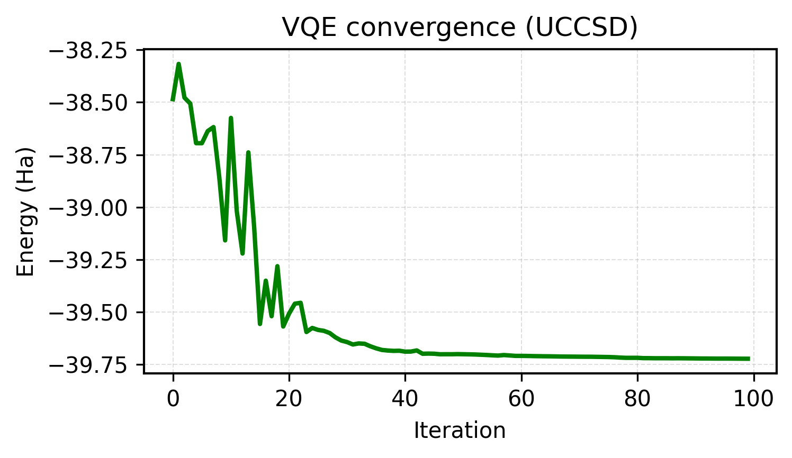

<div style="height: 2.5rem;"></div>

This work is inspired by the chemically aware strategies used in Khan *et al.*’s “Chemically aware unitary coupled cluster with ab initio calculations on an ion trap quantum computer: A refrigerant chemicals’ application” (J. Chem. Phys. 158 (21), 214114, 2023). It also builds on the original ADAPT-VQE framework of Grimsley *et al.* in “An adaptive variational algorithm for exact molecular simulations on a quantum computer” (Nature Communications, 2019)


## The chemistry of cooling systems

Refrigerants are essential components of modern life, enabling cooling and heat transfer across a wide range of systems, ranging from household refrigerators and air conditioners to data centres, hospitals, and industrial processes. As global demand for cooling continues to rise, the choice of refrigerant has become a key lever for both energy efficiency and environmental impact.

Historically, many highly performant and widely used refrigerants, including chlorofluorocarbons (CFCs) and hydrofluorocarbons (HFCs), were later found to have severe environmental side effects: depletion of the ozone layer in the case of CFCs, and extremely high global warming potential (GWP) for HFCs. These findings and subsequent international agreements such as the Montreal Protocol and the Kigali Amendment have driven a rapid transition and influx of research into new, more environmentally benign classes of refrigerants.

Identifying viable next-generation refrigerants that retain favourable thermodynamic and heat-transfer properties, while also being chemically stable, non-toxic, and low-GWP, is a challenging molecular design problem. Computational chemistry plays a central role in this process, allowing researchers to evaluate candidate molecules *in silico* and assess their promise before synthesis. However, the workhorse classical computational chemistry methods, such as density functional theory (DFT) can struggle to accurately describe the electronic structure of refrigerants, particularly in the regimes that often determine their stability, reactivity and decomposition pathways. 

Quantum algorithms such as the Variational Quantum Eigensolver (VQE) provide a complementary pathway for exploring the electronic structure of challenging molecules, particularly when combined with chemically informed ansätze.

In the next section, I connect this challenge to recent advances in adaptive quantum algorithms, and show how they can be explored today using NVIDIA's CUDA-Q platform. To study how adaptive quantum algorithms behave on a chemically relevant system, this demo moves from simple, mean-field approximations to increasingly chemically informed ansätze:

- **Hartree–Fock (HF):** a classical mean-field baseline
- **Variational Quantum Eigensolver (VQE):** a fixed, chemically motivated UCCSD ansatz
- **ADAPT-VQE:** the ansatz is built operator-by-operator from physically meaningful excitations


All results were generated with **CUDA-Q** and run on **qBraid**, running on classical simulation backends (CPU-based), with identical Hamiltonians and reference states across methods to ensure a fair and controlled comparison.

## HF vs UCCSD-VQE vs ADAPT-VQE using CUDA-Q

This workbook focuses on methane (CH₄) as a relevant test system, and follows the same workflow used in the original ADAPT-VQE paper: define a molecular Hamiltonian, choose a minimal basis, and solve for the ground-state energy using increasingly expressive electronic-structure methods.

Methane plays a central role in refrigerant chemistry, both as a component of low-GWP refrigerant blends and as a key decomposition and reaction intermediate. In particular, methane-derived radicals and fragments appear in many degradation pathways of hydrofluorocarbons and emerging refrigerant candidates, making its electronic structure a useful minimal test case for studying chemically relevant excitations in refrigerants, while remaining tractable for near-term quantum algorithms.

All calculations use a minimal STO-3G basis, which keeps the qubit count to 6 qubits, mirroring the setup in the original study and keeping the qubit count manageable for a short demo. 

::: {.callout-note}
To run this notebook locally, install dependencies with:
:::

```bash
pip install cudaq cudaq-solvers py3Dmol
```

```{python}
#| label: environment-setup
#| echo: true
#| eval: false

import cudaq
import cudaq_solvers as solvers
import numpy as np
import pandas as pd
import matplotlib.pyplot as plt
```
### Defining the molecule

We begin by defining the molecular geometry of methane (CH₄). The atomic coordinates are specified explicitly and will be used to construct both the classical and quantum Hamiltonians in later sections. 


```{python}
#| label: define-molecule
#| echo: true
#| eval: false

name = "CH4"

atoms = [
    ["C",  0.0000,  0.0000,  0.0000],
    ["H",  0.6291,  0.6291,  0.6291],
    ["H", -0.6291, -0.6291,  0.6291],
    ["H", -0.6291,  0.6291, -0.6291],
    ["H",  0.6291, -0.6291, -0.6291],
]

geometry = [(e, (x, y, z)) for e, x, y, z in atoms]
```

<div style="display: flex; justify-content: center;">
  <div id="ch4-viewer"
       style="width: 420px; height: 340px; position: relative; margin: 0.75rem 0;
              border: 1px solid #e6e6e6; border-radius: 10px; overflow: hidden;">
  </div>
</div>

```{=html}
<script src="https://3dmol.org/build/3Dmol-min.js"></script>
<script>
(function () {
  const xyz = `5
CH4
C  0.0000  0.0000  0.0000
H  0.6291  0.6291  0.6291
H -0.6291 -0.6291  0.6291
H -0.6291  0.6291 -0.6291
H  0.6291 -0.6291 -0.6291
`;

  const el = document.getElementById("ch4-viewer");
  if (!el) return;

  function renderWhenReady() {
    if (!window.$3Dmol) { setTimeout(renderWhenReady, 50); return; }

    const viewer = $3Dmol.createViewer(el, { backgroundColor: "white" });
    viewer.addModel(xyz, "xyz");
    viewer.setStyle({}, { stick: { radius: 0.16 }, sphere: { scale: 0.32 } });
    viewer.zoomTo();
    viewer.render();
    viewer.spin("y", 0.5);
  }

  renderWhenReady();
})();
</script>
```

<p class="figure-caption"><em>Figure 1. Methane (CH₄) geometry used throughout this demo. The XYZ coordinates define the atomic coordinates which the electronic Hamiltonian is constructed from in the next step.</em>
</p>

### Building the molecular Hamiltonian

Before running VQE or ADAPT-VQE, we generate the second-quantized electronic Hamiltonian for methane in a minimal STO-3G basis. For consistency with the referenced ADAPT-VQE workflow, we also define a compact active space and record the baseline reference energies.

In this setup, the active space contains **3 spatial orbitals** and **2 active electrons**, corresponding to **6 spin-orbitals / 6 qubits** under a Jordan–Wigner mapping.


```{python}
#| label: molecular-hamiltonian
#| echo: true
#| eval: false

molecule = solvers.create_molecule(
    geometry,
    "sto-3g",
    0,   # total spin 2S
    0,   # charge
    nele_cas=2,
    norb_cas=3,
    casci=True,
    verbose=True
)

E_hf = molecule.energies.get("hf_energy")
E_core = molecule.energies.get("core_energy")
E_casci = molecule.energies.get("R-CASCI")
```

| Method | Energy (Ha) |
|------|-------------|
| Hartree–Fock (HF) | -39.726717 |
| Core energy | -38.199070 |
| CASCI (reference) | -39.730452 |

We compute HF and CASCI energies classically using PySCF during Hamiltonian construction. CASCI provides the exact reference for the active space and defines the target energy for the quantum algorithms. These reference energies define the classical benchmarks for the VQE and ADAPT-VQE calculations that follow. 

### Variational Quantum Eigensolver with a fixed UCCSD ansatz

Here we apply the **Variational Quantum Eigensolver (VQE)** using a fixed, chemically motivated UCCSD (Unitary Coupled Cluster with Singles and Doubles) ansatz. This ansatz is widely used in quantum chemistry because it encodes physically meaningful electron excitations while remaining compact enough for near-term quantum devices and simulators.

Starting from the Hartree–Fock reference state, one- and two-electron integrals are used to construct the molecular Hamiltonian. The VQE algorithm then prepares a parameterised quantum state using the UCCSD ansatz, and a classical optimiser (COBYLA) iteratively updates the circuit parameters to minimise the expectation value of this Hamiltonian.

```{python}
#| label: vqe
#| echo: true
#| eval: false

from scipy.optimize import minimize

H = molecule.hamiltonian
n_qubits = 2 * molecule.n_orbitals
n_electrons = molecule.n_electrons
spin_2S = 0

n_params = solvers.stateprep.get_num_uccsd_parameters(n_electrons, n_qubits)

@cudaq.kernel
def ansatz(thetas: list[float]):
    q = cudaq.qvector(n_qubits)
    for i in range(n_electrons):
        x(q[i])
    solvers.stateprep.uccsd(q, thetas, n_electrons, spin_2S)

optimizer = cudaq.optimizers.COBYLA()

energy, params = cudaq.vqe(
    ansatz,
    H,
    optimizer,
    parameter_count=n_params
)

vqe_energies = []

def record_energy(theta):
    e = cudaq.observe(ansatz, H, theta).expectation()
    vqe_energies.append(e)
    return e

theta0 = np.random.normal(0, np.pi, size=n_params)

res = minimize(
    record_energy,
    theta0,
    method="COBYLA",
    options={"maxiter": 60}
)
```

<div style="display: flex; justify-content: center; margin: 1.5rem 0;">
  
</div>
<p class="figure-caption"><em>Figure 2. VQE convergence using the UCCSD ansatz.</em>
</p>

Figure 2 shows the energy obtained at each iteration of the optimiser during the VQE run, showing convergence toward the ground-state energy.

### ADAPT-VQE

We now apply ADAPT-VQE, an adaptive extension of the Variational Quantum Eigensolver in which only the excitations that are important for a given molecule are included in the simulation. Rather than fixing the quantum circuit upfront, ADAPT-VQE builds the ansatz iteratively by selecting operators with the largest energy gradients from a predefined excitation pool.

This selection-and-optimisation process is repeated until convergence, growing the circuit dynamically and tailoring it to the electronic structure of the system, while avoiding unnecessary parameters and circuit depth.

```{python}
#| label: adapt-vqe
#| echo: true
#| eval: false

pool = solvers.get_operator_pool(
    "spin_complement_gsd",
    num_orbitals=molecule.n_orbitals
)

print("qubits (spin orbitals):", n_qubits)

@cudaq.kernel
def init_state(q: cudaq.qview):
    for i in range(n_electrons):
        x(q[i])

E_adapt, thetas_adapt, ops_adapt = solvers.adapt_vqe(
    init_state,
    H,
    pool, 
    max_iterations=4,
    grad_norm_tol=1e-3
)
```

In this demo, only a few iterations of ADAPT-VQE are run to illustrate the adaptive ansatz construction without incurring long runtimes. Even with this restriction, the adaptive circuit reaches essentially the same ground-state energy as UCCSD using fewer parameters.

### Results

Table 1 compares the three electronic-structure methods applied to methane in this simple demo.

| Method                         | Energy (Ha)        | ΔE vs HF (mHa) | Parameter Count |
|--------------------------------|--------------------|----------------|-----------------|
| Hartree–Fock (HF)              | -39.726716691377   | –              | –               |
| VQE (UCCSD)                    | -39.730447613440   | -3.730922      | 8               |
| ADAPT (spin_complement_gsd)    | -39.730451221086   | -3.734530      | 4               |

<br>

While UCCSD-VQE and ADAPT-VQE a comparable ground-state energy, the adaptive approach does so using half the number of variational parameters. This illustrates the core advantage of adaptive ansatz construction: chemical accuracy can be achieved with a significantly more compact quantum circuit when only physically relevant excitations are included. For larger and more strongly correlated molecules, this difference can ultimately determine whether a calculation is feasible at all.
